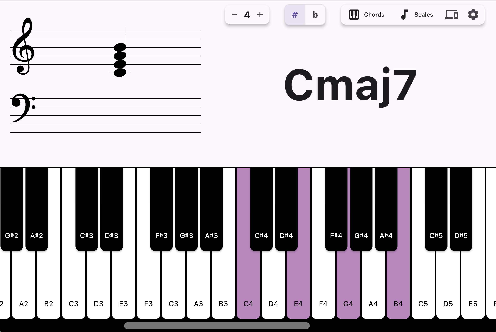
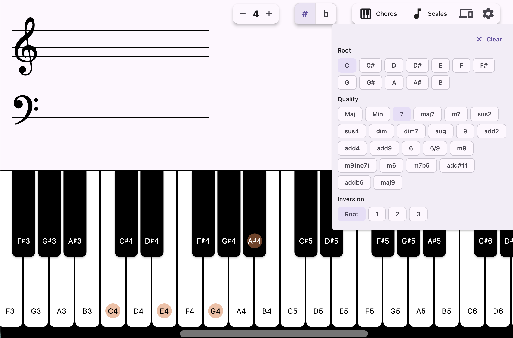
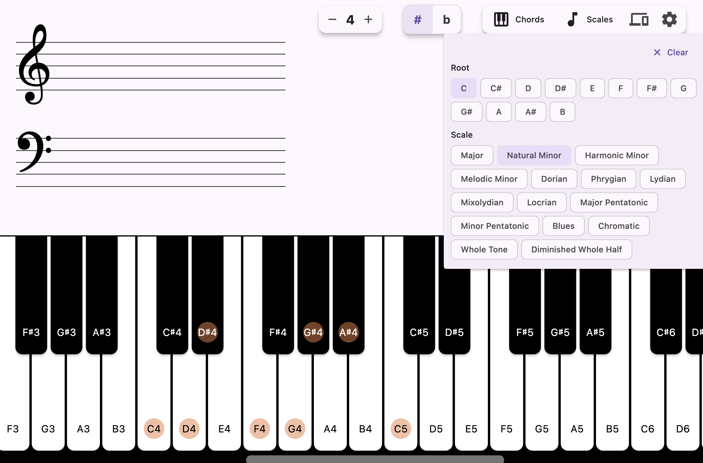
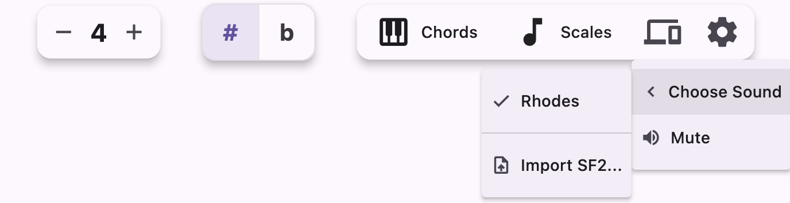

# Live Keys 🎹

Live Keys is a Flutter piano app with real time chord detection,
MIDI input support and a playable keyboard. Fully supported in MacOs, Windows and Android.

## Downloads

[](https://github.com/ErezLavi/live_keys/releases/latest)
[](https://github.com/ErezLavi/live_keys/releases/latest)
[](https://github.com/ErezLavi/live_keys/releases/latest)


## Features

- Chord detection with a chord name display
- Grand staff view of currently pressed notes
- Chord and scales highlighting from the top-right menu
- Hardware MIDI input support (auto-connects to the first available device) / Playing from the computer's keyboard
- SoundFont playback via SF2 assets / uploaded custom SF2 files + mute mode

| Main Layout |
| --- |
|  |

| Chord Detection | Scales |
| --- | --- |
|  |  |

| Menu |
| --- |
|  |

## Controls

- Computer keyboard mapping:
  - `Z S X D C V G B H N J M , L . ; /`
  - `[` and `]` to shift the keyboard octave

## SoundFonts

The app uses SoundFont files for instrument sounds. The default soundfont is set in
`lib/common/constants.dart` (`rhodesSoundFontAsset`). But you can upload your own SoundFont files and use them in the app.

## Getting Started

1. Install a Flutter SDK compatible with Dart 3.9.
2. Clone the repository:
   ```bash
   git clone https://github.com/ErezLavi/live_keys.git
   cd live_keys
   ```
3. Fetch dependencies (requires `git`, since one package is pulled from GitHub):
   ```bash
   flutter pub get
   ```
4. Run the app on one of the supported platforms:
   ```bash
   flutter run -d macos
   flutter run -d windows
   flutter run -d android
   ```
