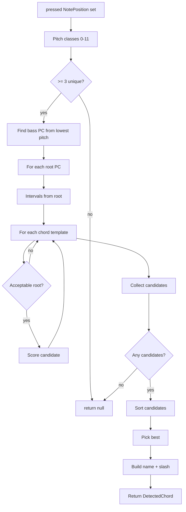

# Chord Detector

This document describes the chord detection logic in `lib/piano/chord_detector.dart`.

## Overview

`ChordDetector.detect` takes a set of pressed `NotePosition` values, converts them to pitch classes, evaluates candidate chords against a chord template database, and returns the best match (including inversion/slash bass notation when appropriate).

### Key Types

- `DetectedChord`: output model containing `name`, `root`, and `bass` (all pitch-class based).
- `Candidate`: internal scoring tuple for a potential `(root, type)` chord match.
- `ChordDetector`: static utility with detection and helper functions.

## Data Dependencies

The detector relies on constants defined in `lib/common/constants.dart`:

- `Constants.chordDB`: map of chord type string to interval template (set of semitone offsets from root).
- `Constants.chordRank`: tie-breaker ranking for chord types.
- `Constants.noteName(int pc)`: pitch-class to note-name conversion for display.

## Detection Flow

1. Convert pressed notes to pitch classes (0-11), de-duplicate, and sort.
2. Reject if fewer than 3 unique pitch classes.
3. Determine the true bass pitch class from the lowest actual pitch.
4. For each pitch class as a candidate root:
   - Compute played intervals from that root.
   - For each chord template:
     - Reject if the template is a triad but the played notes do not include a triad.
     - Score template vs played intervals.
     - Save candidate with score.
5. Sort candidates by:
   - Higher score first.
   - Chord rank (lower rank wins).
   - Prefer root matching the bass pitch class.
   - Lower root pitch class value.
6. Build the final chord name, including inversion/slash bass when needed.

## Mermaid Flow Diagram

## Scoring and Filtering

### Interval Extraction

`_intervalsFromRoot` computes the set of pitch-class offsets (1-11) from a proposed root.

### Root Acceptability

`_acceptableRoot` prevents impossible roots for triads:
- If the chord template is a triad (contains 3rd + 5th, either minor or major), the played intervals must also include a triad.
- If not, that root is rejected.

### Scoring

`_scoreChord` penalizes mismatches:
- `extra = played - template`
- `missing = template - played`
- score = `-(extra + missing * 2)` (missing tones penalized more than extra tones)

## Naming and Inversions

`_buildName` forms `rootName + chordType` and decides whether to add a slash bass:

- If bass is the root, no slash.
- If bass is the 3rd or 5th, a slash is used.
- Any other bass pitch class always produces a slash.

Example: `Cmaj/E`, `Dm/F`, `G7/B`.

### Chord Name Format for UI

The returned chord name always starts with the root note (optionally with `#` or `b`), followed by the chord type and any slash bass. This makes it easy to render the root with a larger font size in the UI by splitting the string into:

- Root: first 1 or 2 characters (`A`-`G` plus optional accidental).
- Suffix: the remaining chord type and optional `/bass`.

## Notes and Edge Cases

- Fewer than three pitch classes returns `null` (no chord).
- Duplicated octaves do not affect detection because pitch classes are de-duplicated.
- The bass is determined by actual pitch, not pitch class order.
- Score ties are resolved by chord rank, then bass match, then root pitch class.

## References

- Source: `lib/piano/chord_detector.dart`
- Constants: `lib/common/constants.dart`
